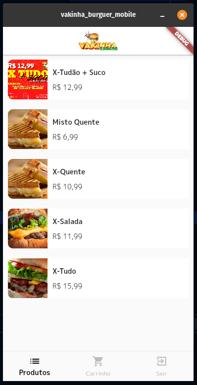

# vakinha_burguer_mobile

A new Flutter project by the Academia do Flutter's Dart Week.

With this project I had the opportunity to get to know a lot of Flutter widgets and implementations, and also a project structure, with access to the BackEnd.

There is still a lot for me to explore in this project.

Vakinha Burguer is a delivery application for snacks, with payment with Pix.

<h2>  Project's page

---

---

---

---

---

---

---

---

## Getting Started

This project is a starting point for a Flutter application.

A few resources to get you started if this is your first Flutter project:

- [Lab: Write your first Flutter app](https://flutter.dev/docs/get-started/codelab)
- [Cookbook: Useful Flutter samples](https://flutter.dev/docs/cookbook)

For help getting started with Flutter, view our
[online documentation](https://flutter.dev/docs), which offers tutorials,
samples, guidance on mobile development, and a full API reference.
